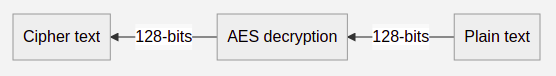

# Requirements
Requirements for this project can be formulated by analysing the drawbacks of the previous standards of block encryption, the requirements of the traditional AES algorithm as well as the new components which are added to this Enhanced AES algorithm.

## Feature identification
- Encryption of plaintext (128-bits) into ciphertext (128-bits).

- Decryption of ciphertext (128-bits) to plaintext (128-bits).

- 256 Byte memory module to be used as Look-up Table.

- A pseudo-random sequence generator for key generation and filling substitution box.

- Round key function which provides distinct key for each round of the encryption/decryption algorithm.

- Each round of the encryption algorithm which modifies the 128-bit block via substitution, row mixing and column mixing.

## State of art
With the computational power of current systems, any brute force key guessing attack on the encryption algorithm would result in massive space-time complexity and would be practically infeasible.

## SWOT analysis
### Strengths
- Highly secure and protected against attacks.
- Incredibly efficient for hardware implementatoin.
- High speed encryption and decryption.

### Weakness
- PN sequence set generation utilizes few clock cycles.
- Extra hardware resources required for implementation.

### Opportunities
- Can replace traditional AES algorithm as the new block cipher standard.
- A lightweight version of this algorithm can be used in deviced with lesser computation power.

### Threats
- Greater computational power of the future may leave the system outdated.
- Better attack stratergies may be formulated against the system.

## 4W's and 1H
### Who
A general user who wants secure transmission of his valuable and private information.

### What
A block cipher, which takes 128-bits of plaintext and gives 128-bits of pseudo-random ciphertext.

### When
Can be used when it is not safe to transmit data as plaintext.

### Where
Can be used in web browsers, servers, IOT devices, data centers, etc.

### How
Take in 128-bits of plaintext and a key of size 128-bits generated via PN sequence. Fill the substitution box with the same PN sequence values. Formulate a round key for each round of encryption. Add the round key to plaintext block. Substitute values from substitution box. Perform row shifting and column mixing operations. Repeat steps 4, 5 and 6 several time, each iteration called a round. Present the 128-bit output as ciphertext.

## High level requirements
| S. No. | Description |
|:--:|--|
| 1. | Key generator |
| 2. | Round key function | 
| 3. | Substitution box |
| 4. | Round implementation |

## Low level requirements
| S. No. | Description |
|:--:|--|
| 1. | PN sequence generator |
| 2. | Memory module |
| 3. | Substitution look-up table |
| 4. | Row shifting operation |
| 5. | Column mixing operation |
| 6. | Galois field arithmetic functions |