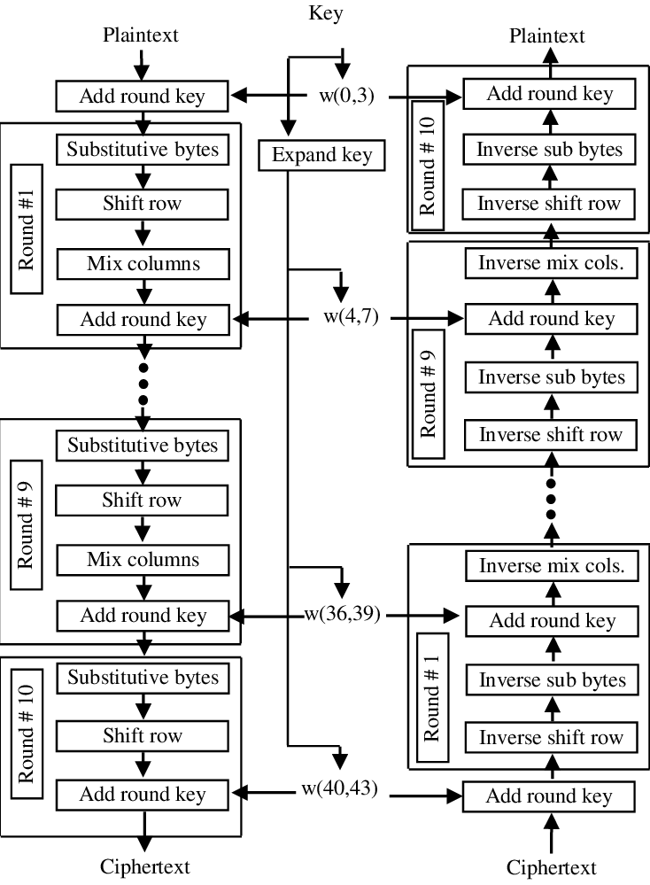

# Design
## High level design

## Low level design
- ### PN sequence generator
    Using LFSR in [8 6 5 4] configuration as a PN sequence generator.
![[8 6 5 4] configuration LFSR](LFSR8654.png)

- ### Memory module
    Using register array as memory module.

- ### Substitution box LUT
    Using register array to store values from PN sequence generator

- ### Rotation and mixing functions
    Using simple row index rotation, and matrix multilication based column mixing.

- ### Galois field multiplication
    Using concept of finite fields, and considering the polynomial  as irreducible polynomial for GF(8).

